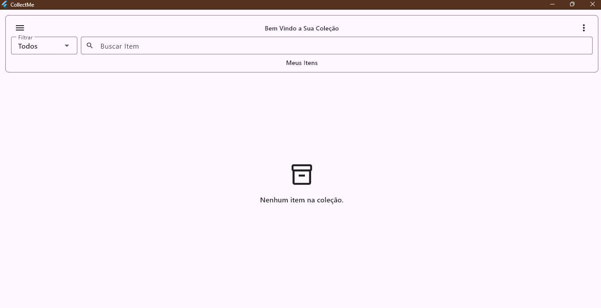
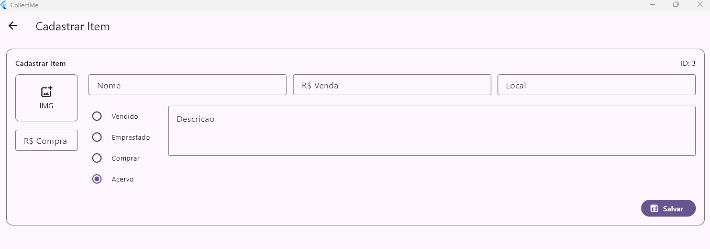
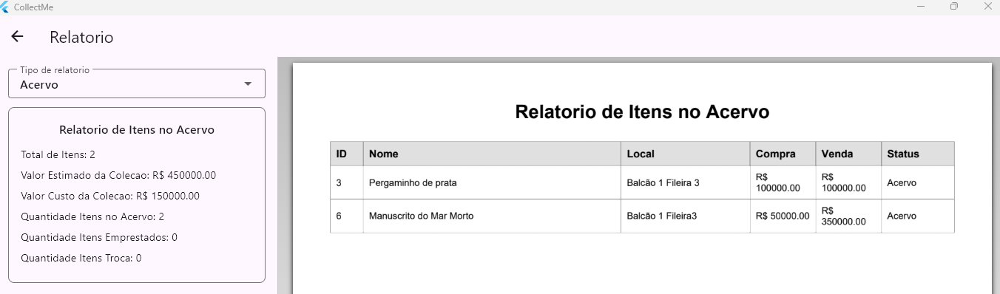

# CollectMe

CollectMe é um aplicativo Flutter para organizar itens de coleção pessoal. Ele ajuda a cadastrar itens, controlar valores, acompanhar status, registrar empréstimos e gerar relatórios em PDF para impressão ou compartilhamento.

O projeto Flutter fica na pasta [`collection_app`](collection_app).

## O que o projeto resolve

Quem tem uma coleção física costuma perder informações importantes com facilidade: onde o item está guardado, quanto custou, quanto vale, se foi vendido, emprestado ou se ainda precisa ser comprado (lista de desejos).

O CollectMe centraliza esses dados em um app desktop simples, com armazenamento local em SQLite e telas voltadas para uso diário.

## Funcionalidades

- Cadastro de itens com nome, descrição, imagem, local de armazenamento, valor de compra, valor de venda e estado de conservação.
- Listagem dos itens ativos em formato de tabela.
- Busca por nome, descrição ou local.
- Filtros por status e ordenação.
- Edição de itens cadastrados.
- Exclusão lógica de itens, mantendo o registro salvo como inativo.
- Registro de empréstimo, com dados da pessoa, datas, observações e imagens.
- Relatórios em PDF por tipo: geral, acervo, vendidos, a comprar e emprestados.
- Seleção manual dos itens que entram no relatório.
- Impressão e compartilhamento do PDF.

## Imagens do app

### Tela Inicial



### Cadastro de item



### Relatório



## Compatibilidade atual

| Plataforma | Status | Observação |
| --- | --- | --- |
| Windows | Suportado no escopo atual | Plataforma principal do projeto neste momento. |
| Linux | Possível como desktop | Pode exigir bibliotecas nativas do SQLite instaladas no sistema. |
| macOS | Possível como desktop | Pode exigir ajustes de assinatura/permissões dependendo do ambiente. |
| Web | Não garantido no estado atual | A camada de banco usa `sqflite_common_ffi`, voltado para desktop. |
| Android | Não garantido no estado atual | Para mobile, o ideal é adaptar a persistência para `sqflite`. |
| iOS | Não garantido no estado atual | Para mobile, o ideal é adaptar a persistência para `sqflite`. |

O projeto foi desenvolvido com foco em desktop. As pastas de Web, Android, iOS, Linux e macOS existem porque o Flutter cria essa estrutura, mas isso não significa que todas as plataformas estejam validadas.

Para suportar Web, Android ou iOS com segurança, o ponto principal é adaptar a camada de banco de dados em `collection_app/lib/data/datasources/collection_datasource.dart`.

## Requisitos

| Requisito | Versão usada pelo projeto | Download |
| --- | --- | --- |
| Flutter | `>= 3.35.0` | [flutter.dev/install](https://docs.flutter.dev/get-started/install) |
| Dart SDK | `>= 3.11.4 < 4.0.0` | Incluído no Flutter |
| Git | Versão atual estável | [git-scm.com/downloads](https://git-scm.com/downloads) |
| Visual Studio | 2022 ou superior, com workload Desktop development with C++ | [visualstudio.microsoft.com/downloads](https://visualstudio.microsoft.com/downloads/) |
| Linux desktop | Ambiente configurado para Flutter desktop | [docs.flutter.dev/platform-integration/linux](https://docs.flutter.dev/platform-integration/linux/setup) |
| macOS desktop | macOS com Xcode instalado | [docs.flutter.dev/platform-integration/macos](https://docs.flutter.dev/platform-integration/macos/setup) |

Observações:

- O Dart SDK vem junto com o Flutter, então não é necessário instalar o Dart separadamente.
- No Windows, o Visual Studio é necessário para compilar e executar o app desktop.
- Web, Android e iOS exigem revisão da persistência local antes de serem considerados suportados.

Para conferir se o ambiente está pronto:

```bash
flutter doctor
```

Para verificar as versões instaladas:

```bash
flutter --version
dart --version
git --version
```

Para listar os dispositivos e plataformas disponíveis:

```bash
flutter devices
```

## Como baixar

Clone o repositório:

```bash
git clone <url-do-repositorio>
```

Entre na pasta do projeto:

```bash
cd collection_app
```

## Como instalar as dependências

```bash
flutter pub get
```

## Como executar

No Windows:

```bash
flutter run -d windows
```

No Linux:

```bash
flutter run -d linux
```

No macOS:

```bash
flutter run -d macos
```

Se tentar executar em Web, Android ou iOS no estado atual, podem ocorrer erros relacionados ao banco local. Antes de liberar essas plataformas, adapte a persistência para cada ambiente.

## Comandos úteis

Analisar o projeto:

```bash
flutter analyze
```

Rodar testes:

```bash
flutter test
```

Formatar o código:

```bash
dart format lib test
```

Gerar build para Windows:

```bash
flutter build windows
```

## Tecnologias usadas

- Flutter `>= 3.35.0`
- Dart `>= 3.11.4 < 4.0.0`
- SQLite com `sqflite_common_ffi`
- `pdf` para geração dos relatórios
- `printing` para preview, impressão e compartilhamento dos PDFs
- `file_picker` para seleção de imagens
- `path` para manipulação de caminhos de arquivos

## Estrutura de pastas

```text
collection_app/
  lib/
    controllers/       Controladores dos formulários
    core/
      enum/            Enums de filtro e status
    data/
      datasources/     Acesso ao SQLite
      models/          Modelos de dados
      repositories/    Camada de repositório
    pages/             Telas do aplicativo
    routes/            Rotas do app
    services/          Serviços de imagem e relatório
    widgets/           Componentes reutilizáveis

  images/              Imagens salvas dos itens
  test/                Testes automatizados
  windows/             Configurações nativas do Windows
  linux/               Configurações nativas do Linux
  macos/               Configurações nativas do macOS
  android/             Configurações nativas do Android
  ios/                 Configurações nativas do iOS
  web/                 Configurações para web
```

## Banco de dados

Os dados são salvos localmente em SQLite, no arquivo `collection_app.db`.

A tabela principal é `collections`. Cada item é salvo com um `id` e um `payload` em JSON, o que facilita manter os dados do item agrupados, incluindo informações de empréstimo.

## Observações

- A exclusão de itens é lógica: o item fica marcado como inativo.
- Os relatórios usam os itens selecionados na tela de relatório.
- O nome técnico do pacote Dart continua sendo `collection_app`, por isso os imports usam `package:collection_app/...`.
- As versões específicas do projeto ficam registradas em `collection_app/pubspec.yaml` e `collection_app/pubspec.lock`.
